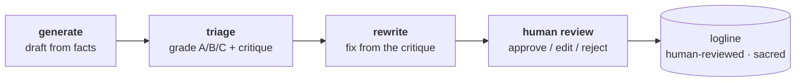

# spooky

[](https://github.com/EvanWAppel/spooky/actions/workflows/ci.yml)

**Live demo:** _link added after deploy — see [`docs/deploy.md`](docs/deploy.md)_

**An episode data explorer for *The X-Files* — built around the fact that
nobody agrees which episodes are "mythology."**

Fans split the show into the long-running conspiracy arc ("mythology") and
everything else ("monster-of-the-week"). It sounds settled; it is not. The
three closest things to an authority — Fox's own *Mythology* DVD box sets,
Wikipedia's dagger flags, and the dom111 fan dataset — give three different
mythology counts and disagree on roughly one episode in ten. **spooky stores
all three verdicts per episode, derives a defensible label by vote (a source
that doesn't cover an episode abstains), and renders the disagreement as a
first-class feature** — contested episodes carry a badge and a per-source
breakdown instead of a quietly-picked winner.

## What's in it

- **The chart** — all 11 seasons stacked by classification
  (mythology / monster-of-the-week / standalone), colorblind-safe palette,
  films deliberately excluded so bar heights mean what they appear to mean.
- **Click anything** — a chart segment filters the sortable, filterable
  episode table; a row opens the detail panel; every view state lives in
  the URL and survives a reload.
- **220 records** — 218 episodes + both films, each with credits, TVmaze
  rating, air date, production code, the three source labels, the derived
  label with its written rationale, and links out to IMDb and TMDB's
  where-to-watch page.
- **A published dataset** — [`data/dist/`](data/dist), CC BY-SA 4.0, with
  per-field provenance down to exact Wikipedia revision ids. Field
  dictionary in [`data/README.md`](data/README.md).

## AI-drafted loglines — draft → triage → rewrite → review

The most involved engineering here is the logline pipeline. Episode teasers are
**drafted by Claude from factual inputs, guarded mechanically, graded, corrected,
then handed to a human to approve** — never copied from a source (that's illegal;
loglines are capped at 30 words) and never silently trusted.



- **Mechanical guardrails, not prompt hope** — a draft is rejected and
  re-requested if it exceeds 30 words or shares a run of more than 8 words with
  any source text (`build/loglines.py::contains_verbatim_run`), enforced in code.
- **A self-correction loop that measurably works** — triage grades every draft
  A/B/C with a one-line critique; the rewrite step feeds that critique back as an
  editor's note. Over 218 drafts it moved the grade distribution from
  **A=117 / B=87 / C=14 → A=171 / B=45 / C=2** — A-grade drafts from 54% to 78%,
  and the factual-error C's from 14 down to 2.
- **A sacred human layer** — machine drafts (`logline_generated`) never touch the
  human-owned `logline`; `build/merge.py` raises rather than overwrite a reviewed
  field, so no refresh can clobber human judgment.
- **Instrumented** — each run logs tokens, cost, latency, retries, and refusals;
  a full triage pass over 218 drafts is ~$0.30 on `claude-sonnet-4-6`.

Drafts are currently **AI-drafted pending human review** — the published dataset
shows them behind an *AI-drafted* badge until a human approves each one. Full
design notes: **[`docs/ai-pipeline.md`](docs/ai-pipeline.md)**.

## How it's built

Python end-to-end: an offline pipeline (`build/`) fetches TVmaze, Wikipedia,
Wikidata, and the dom111 labels; merges them on TVmaze's episode spine;
classifies; and emits the committed dataset a Plotly Dash app reads. Nothing
is fetched at request time.

```
uv sync
uv run pytest            # 100+ tests, offline, deterministic
uv run python app.py     # the app, on the committed data
uv run python -m build   # rebuild the dataset from live sources
```

Engineering choices worth a look:

- **TDD against recorded reality** — parsers are tested on committed
  fixtures of real API payloads (the wikitext parser's edge cases were
  *counted by hand* from the recorded pages before the parser existed).
- **Human edits are sacred** — reviewed loglines live in a separate layer
  no pipeline step may overwrite; a refresh that would touch one raises
  with a diff (`tests/test_review_guard.py`).
- **Legal-shape tests in CI** — no synopses, no imagery, no IMDb ratings,
  every field attributed (`tests/test_legal.py`, `tests/test_provenance.py`).
  The what-and-why lives in [`DECISIONS.md`](DECISIONS.md).

## Licensing

Two layers. **The code** (`build/`, `components/`, `spooky/`, `tools/`, `app.py`)
is [MIT](LICENSE). **The data** is CC BY-SA 4.0, because the sources require it:

Episode metadata and ratings from [TVmaze](https://www.tvmaze.com)
(CC BY-SA 4.0). Episode structure and flags derived from
[Wikipedia](https://en.wikipedia.org/wiki/List_of_The_X-Files_episodes)
(CC BY-SA 4.0; modified). Identifiers from [Wikidata](https://www.wikidata.org)
(CC0). Mythology/MOTW labels adapted from
[dom111/xfiles-episode-picker](https://github.com/dom111/xfiles-episode-picker)
(MIT). The derived dataset is published under CC BY-SA 4.0.

This is an unofficial fan project. It is not affiliated with, endorsed by,
or approved by 20th Television, The Walt Disney Company, or Ten Thirteen
Productions. *The X-Files* and all related marks are the property of their
respective owners. No episode imagery, synopses, or transcripts are used
or distributed.
